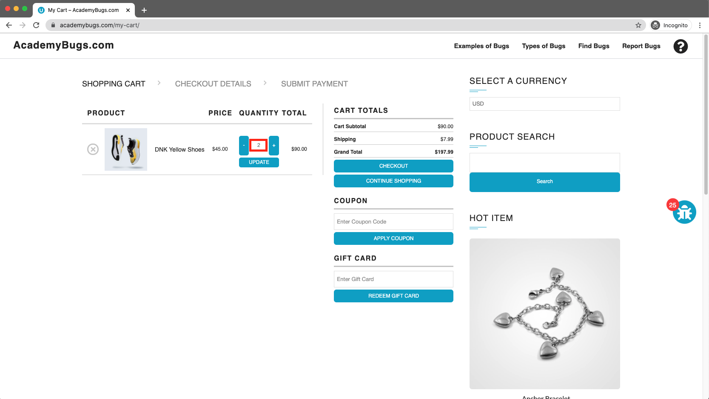
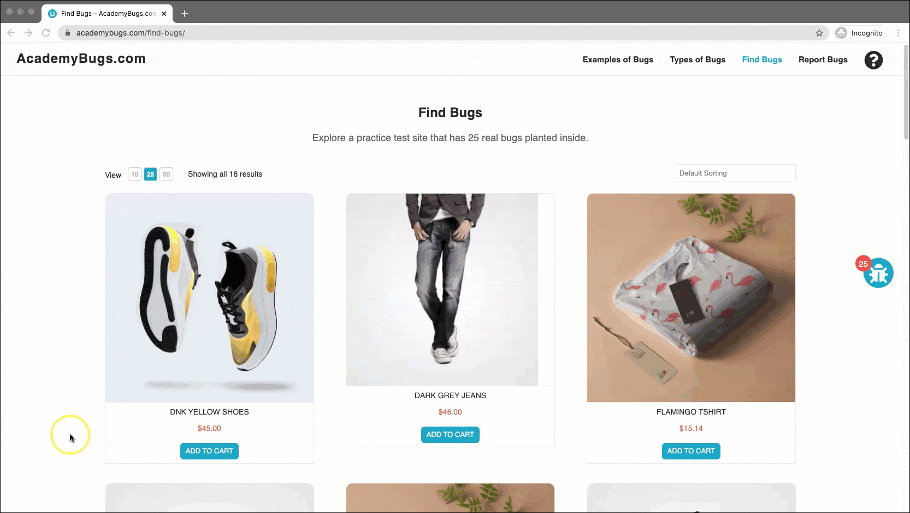

# Bug Report

## Bug ID
BUG-001

## Title
Product quantity resets to 2 when attempting to set a quantity of 3 or more in cart

## Environment
- OS: Windows / macOS
- Browser: Chrome / Firefox / Edge
- Website: https://academybugs.com

## Preconditions
User has added one or more products to the shopping cart.

## Steps to Reproduce
1. Open the browser and navigate to `https://academybugs.com`
2. Add one or more products to the cart
3. Click the **View cart** link at the top of the page
4. Change the product quantity input field to 3 or more
5. Click the **Update** button below the item

## Expected Result
The cart should update and display the selected item quantity (3 or more).

## Actual Result
The product quantity automatically resets back to 2 upon clicking update.

## Severity
High

## Priority
High

## Attachment

