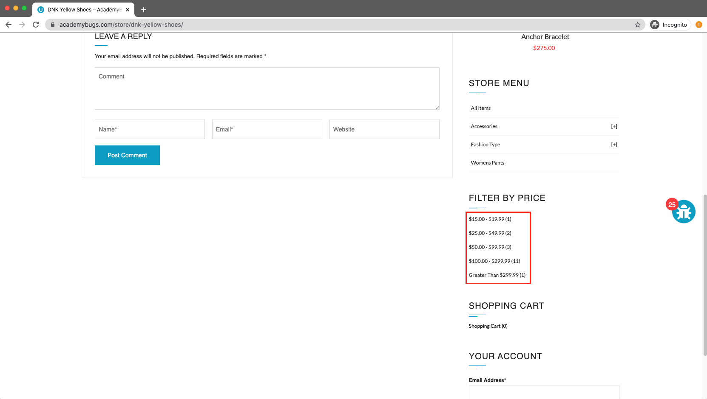
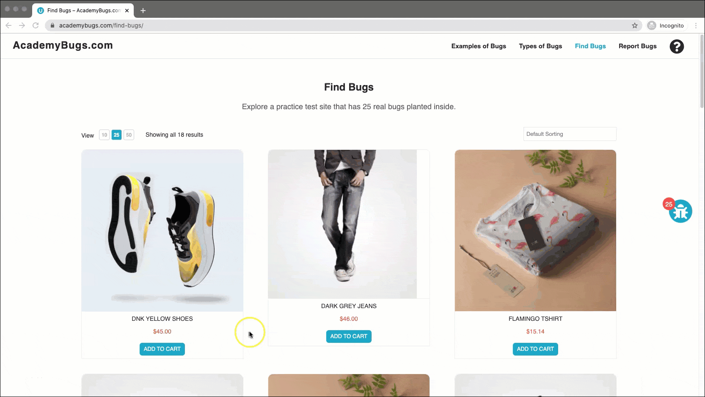

# Bug Report

## Bug ID
BUG-004

## Title
Price filter does not filter products and reloads current page

## Environment
- OS: Windows / macOS
- Browser: Chrome / Firefox / Edge
- Website: https://academybugs.com

## Preconditions
User is on the AcademyBugs homepage.

## Steps to Reproduce
1. Open the browser and navigate to `https://academybugs.com`
2. Click on the **Find Bugs** link in the navigation bar
3. Open any product page (or select an item from the Store Menu)
4. Locate the **Filter by Price** section on the right side menu
5. Select any of the price ranges

## Expected Result
A filtered list displaying only products within the selected price range should be shown.

## Actual Result
The filter fails to apply and simply reloads the current page without changing product display.

## Severity
Medium

## Priority
Medium

## Attachment

