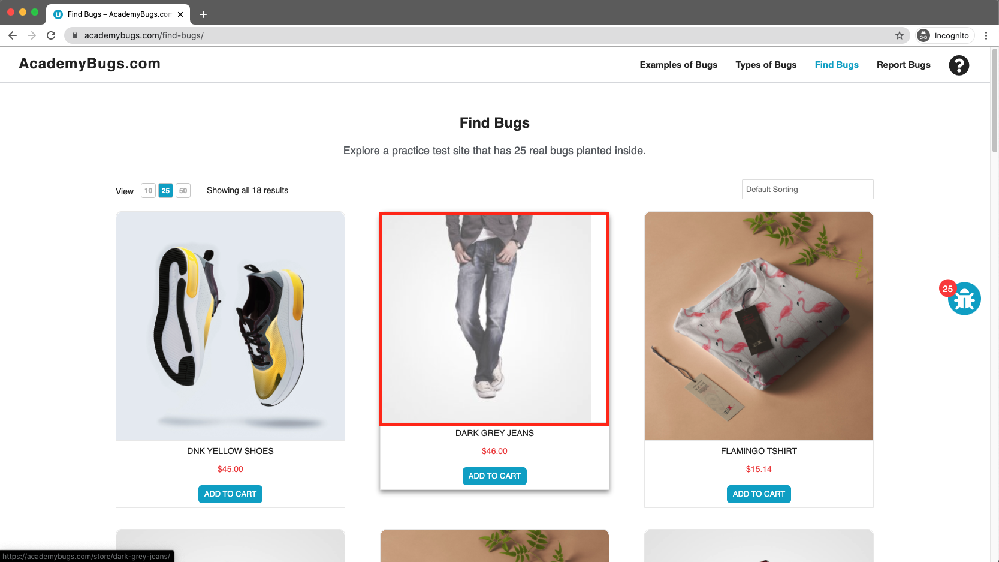
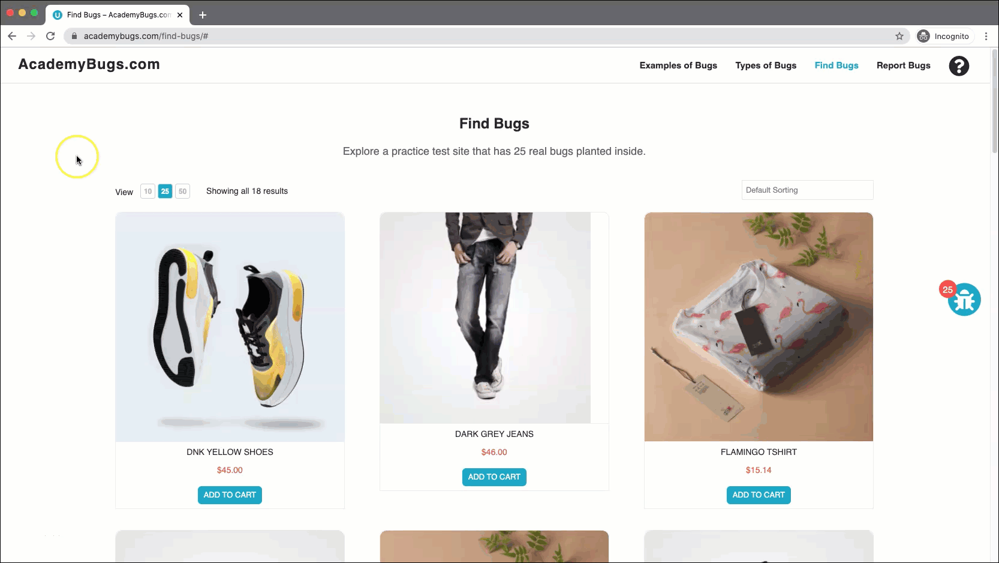

# Bug Report

## Bug ID
BUG-006

## Title
Product image does not fill the display box completely on "Dark Grey Jeans" page

## Environment
- OS: Windows / macOS
- Browser: Chrome / Firefox / Edge
- Website: https://academybugs.com

## Preconditions
User is on the AcademyBugs homepage.

## Steps to Reproduce
1. Open the browser and navigate to `https://academybugs.com`
2. Click on the **Find Bugs** link in the navigation bar
3. Click on the **Dark Grey Jeans** product

## Expected Result
The product image should scale properly and fill the image container box entirely.

## Actual Result
The product image is misaligned, leaving an unrendered white space on the right side of the container box.

## Severity
Medium

## Priority
Medium

## Attachment

