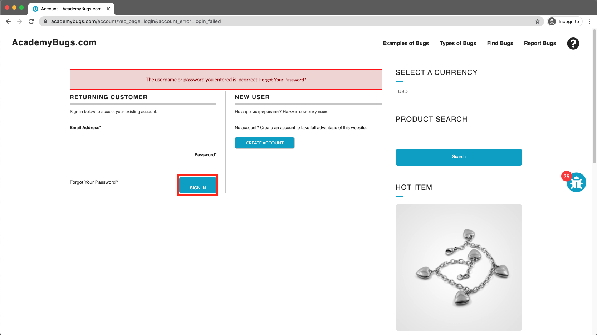

# Bug Report

## Bug ID
BUG-007

## Title
"Sign In" button text caption is vertically misaligned in the sidebar form

## Environment
- OS: Windows / macOS
- Browser: Chrome / Firefox / Edge
- Website: https://academybugs.com

## Preconditions
User is on the AcademyBugs homepage.

## Steps to Reproduce
1. Open the browser and navigate to `https://academybugs.com`
2. Click on the **Find Bugs** link in the navigation bar
3. Open any product page
4. Scroll down to the bottom of the right-side menu to locate the Sign In form
5. Enter unregistered login credentials and click the **Sign In** button

## Expected Result
The text caption on the "Sign In" button should be vertically centered within the button container.

## Actual Result
The text caption on the "Sign In" button is vertically misaligned relative to the button boundaries.

## Severity
Low

## Priority
Low

## Attachment

