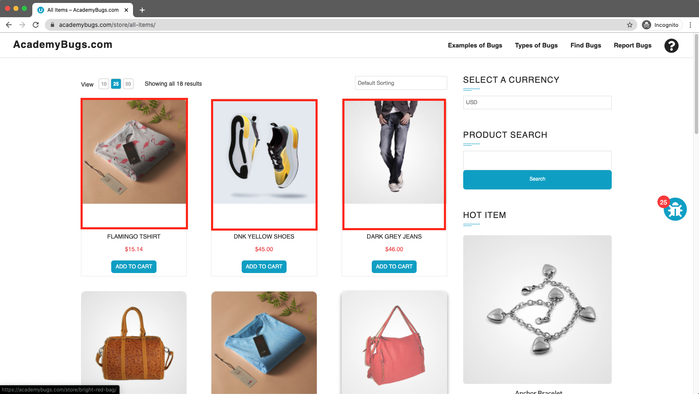
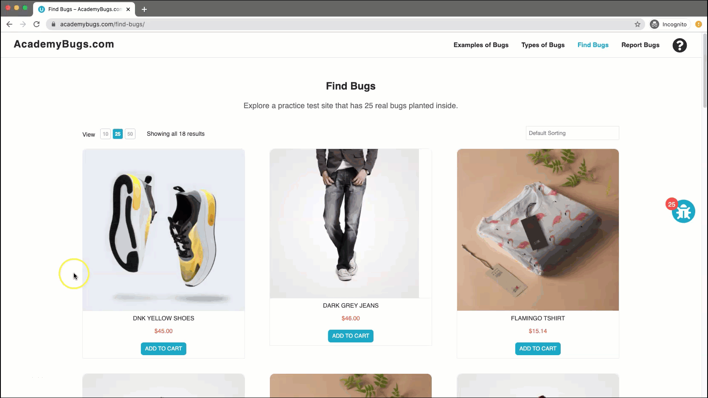

# Bug Report

## Bug ID
BUG-008

## Title
Excessive empty space displayed underneath product images in the "All Items" store list

## Environment
- OS: Windows / macOS
- Browser: Chrome / Firefox / Edge
- Website: https://academybugs.com

## Preconditions
User is on the AcademyBugs homepage.

## Steps to Reproduce
1. Open the browser and navigate to `https://academybugs.com`
2. Click on the **Find Bugs** link in the navigation bar
3. Click on any product to open its details page
4. Locate the **Store Menu** section in the right side menu
5. Click on **All Items**

## Expected Result
Product images should be formatted cleanly without extra whitespace beneath them.

## Actual Result
Product images display noticeable, unnecessary blank space directly underneath the image frames.

## Severity
Low

## Priority
Low

## Attachment

