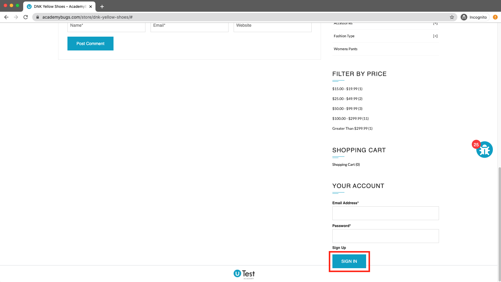

# Bug Report

## Bug ID
BUG-009

## Title
Sign In button overlaps footer element on products without color options

## Environment
- OS: Windows / macOS
- Browser: Chrome / Firefox / Edge
- Website: https://academybugs.com

## Preconditions
User is on the AcademyBugs homepage.

## Steps to Reproduce
1. Open the browser and navigate to `https://academybugs.com`
2. Click on the **Find Bugs** link in the navigation bar
3. Open any product page that has no color selection options
4. Scroll down to the bottom of the right side menu

## Expected Result
The "Sign In" button should be rendered cleanly above the page footer with appropriate spacing.

## Actual Result
The "Sign In" button overlaps and obscures the footer area.

## Severity
Low

## Priority
Low

## Attachment

