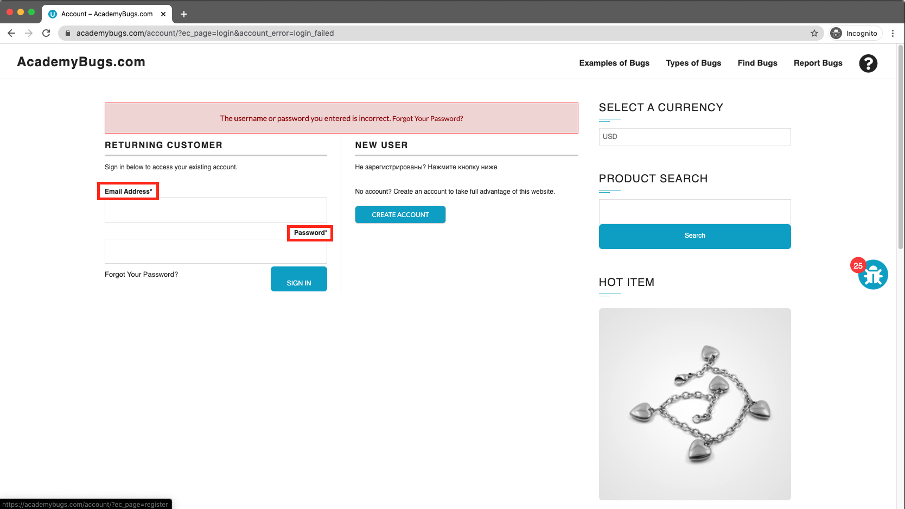
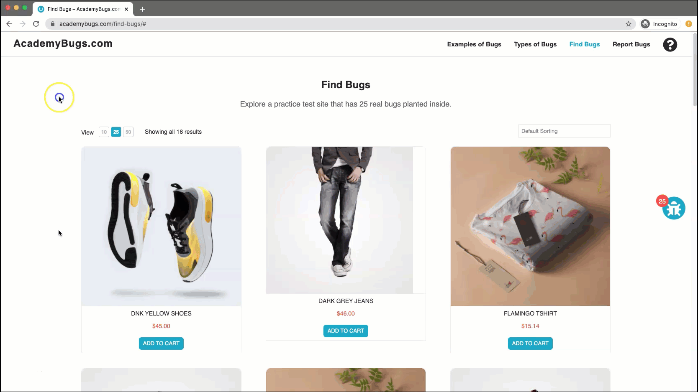

# Bug Report

## Bug ID
BUG-010

## Title
Password field title label is misaligned on the Sign In page

## Environment
- OS: Windows / macOS
- Browser: Chrome / Firefox / Edge
- Website: https://academybugs.com

## Preconditions
User is on the AcademyBugs homepage.

## Steps to Reproduce
1. Open the browser and navigate to `https://academybugs.com`
2. Click on the **Find Bugs** link in the navigation bar
3. Click on any product to open its details page
4. Scroll down to the bottom of the right side menu
5. Click **Sign In** without filling out the form to navigate to the full Sign In page

## Expected Result
The "Password" field title label should be aligned consistently with the field label above it ("Username or Email Address").

## Actual Result
The "Password" field title label is noticeably misaligned compared to the label above it.

## Severity
Low

## Priority
Low

## Attachment

