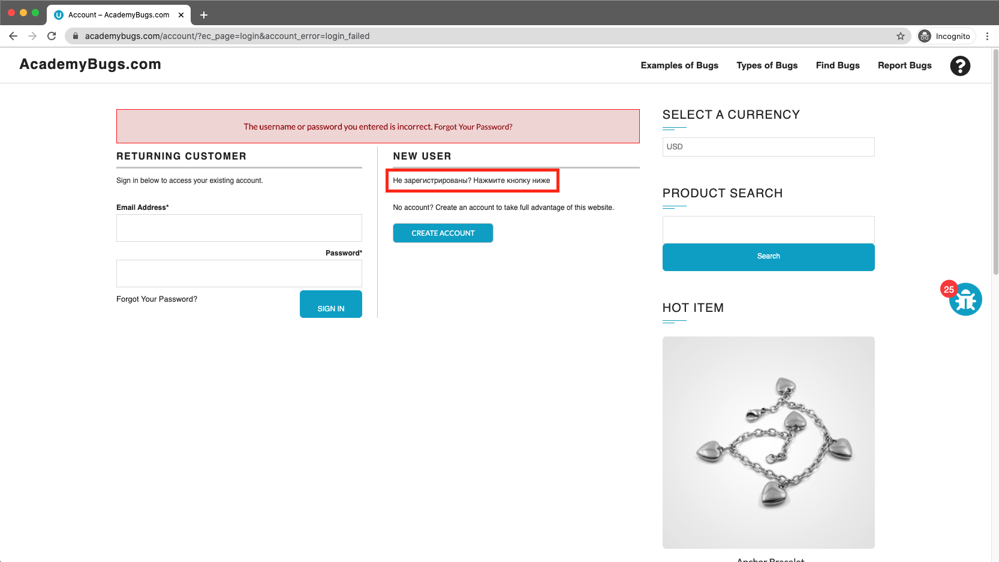

# Bug Report

## Bug ID
BUG-011

## Title
Text under the New User section on the Sign In page is in non-English text

## Environment
- OS: Windows / macOS
- Browser: Chrome / Firefox / Edge
- Website: https://academybugs.com

## Preconditions
User is on the AcademyBugs homepage.

## Steps to Reproduce
1. Open the browser and navigate to `https://academybugs.com`
2. Click on the **Find Bugs** link in the navigation bar
3. Click on any product to open its details page
4. Scroll down to the bottom of the right-side menu
5. Click **Sign In** to navigate to the full Sign In page

## Expected Result
The descriptive text under the "New User" section should be written in English.

## Actual Result
The text under the "New User" section is displayed in another language (placeholder text).

## Severity
Low

## Priority
Low

## Attachment

