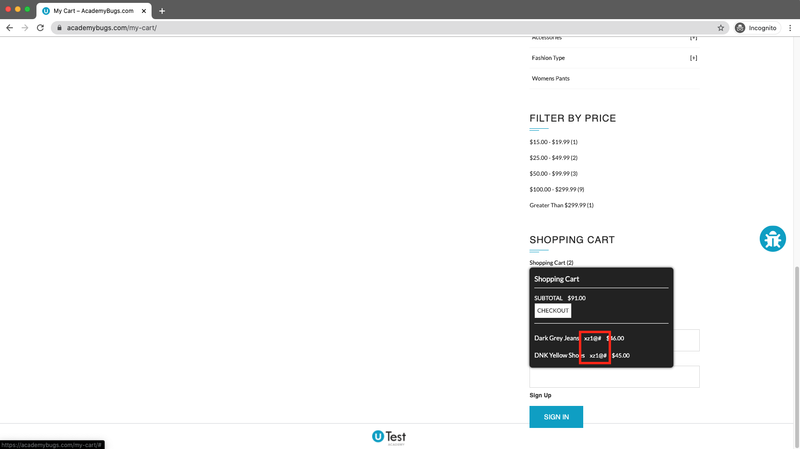
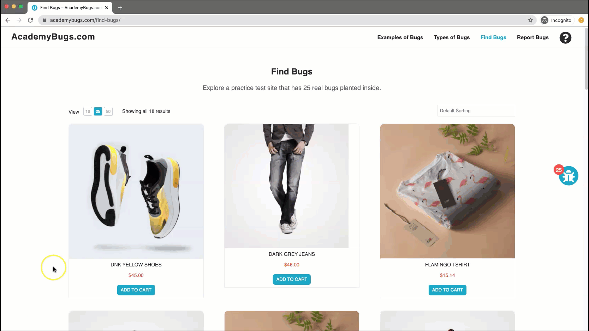

# Bug Report

## Bug ID
BUG-012

## Title
Unreadable symbols displayed in the shopping cart hover popup

## Environment
- OS: Windows / macOS
- Browser: Chrome / Firefox / Edge
- Website: https://academybugs.com

## Preconditions
User is on the AcademyBugs homepage.

## Steps to Reproduce
1. Open the browser and navigate to `https://academybugs.com`
2. Click on the **Find Bugs** link in the navigation bar
3. Add one or more products to the cart
4. Click **View Cart** on top of the page
5. Scroll down to the Shopping Cart section of the right-side menu
6. Hover over the "Shopping Cart" caption header

## Expected Result
All text characters within the popup preview should display properly in readable English text.

## Actual Result
The shopping cart popup displays corrupted/unreadable symbols instead of legible text.

## Severity
Low

## Priority
Low

## Attachment

