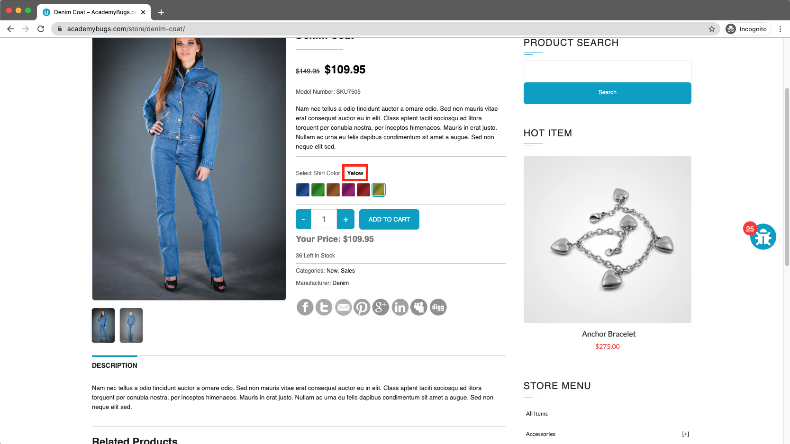

# Bug Report

## Bug ID
BUG-014

## Title
Spelling errors in product color options ("Yelow" and "Orang")

## Environment
- OS: Windows / macOS
- Browser: Chrome / Firefox / Edge
- Website: https://academybugs.com

## Preconditions
User is on the AcademyBugs homepage.

## Steps to Reproduce
1. Open the browser and navigate to `https://academybugs.com`
2. Click on the **Find Bugs** link in the navigation bar
3. Open a product page that features color selection options
4. Observe the color dropdown/option names, specifically selecting Yellow and Orange

## Expected Result
Color names should be spelled correctly as "Yellow" and "Orange".

## Actual Result
Color names contain spelling errors, displaying "Yelow" instead of "Yellow" and "Orang" instead of "Orange".

## Severity
Low

## Priority
Low

## Attachment

