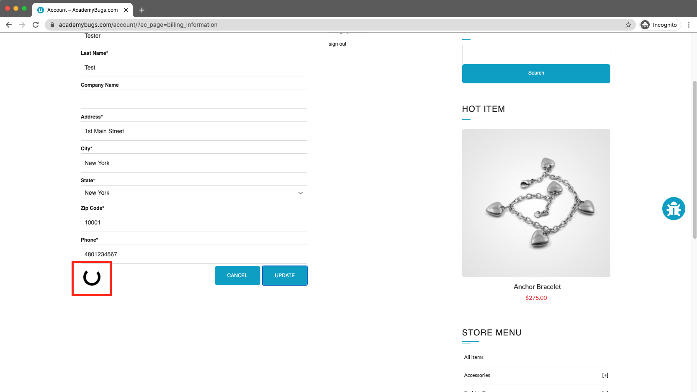
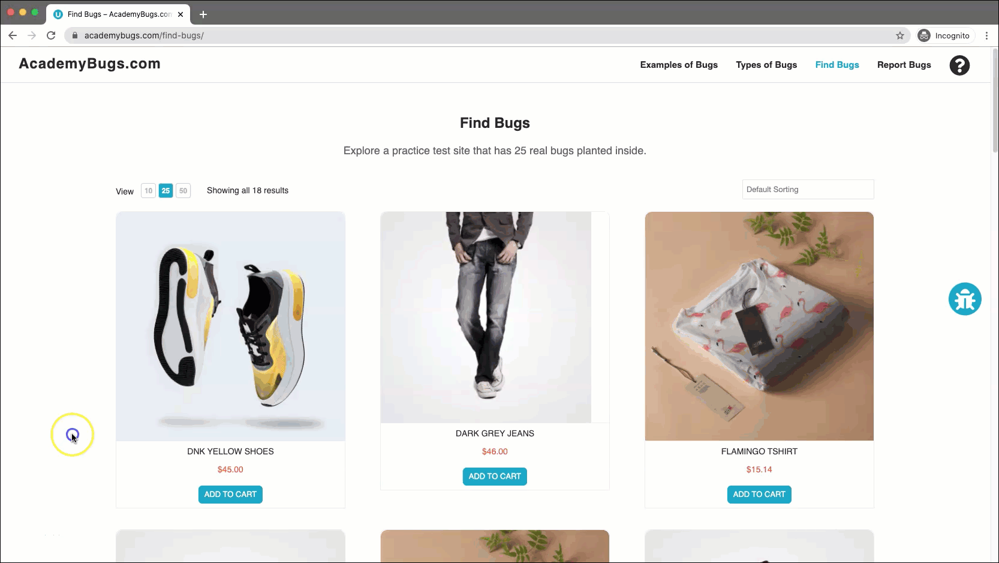

# Bug Report

## Bug ID
BUG-016

## Title
Billing Information fails to update and loads infinitely upon submitting changes

## Environment
- OS: Windows / macOS
- Browser: Chrome / Firefox / Edge
- Website: https://academybugs.com

## Preconditions
User is logged in on the AcademyBugs website.

## Steps to Reproduce
1. Open the browser and navigate to `https://academybugs.com`
2. Click on the **Find Bugs** link in the navigation bar
3. Click on any product to open its details page
4. Click **Billing Information** at the top of the right-side menu
5. Fill out the billing information form with valid details
6. Click the **Update** button

## Expected Result
Billing information should update successfully and display a confirmation message.

## Actual Result
The page hangs on an infinite loading state after clicking "Update" and the billing information is not updated.

## Severity
High

## Priority
High

## Attachment

