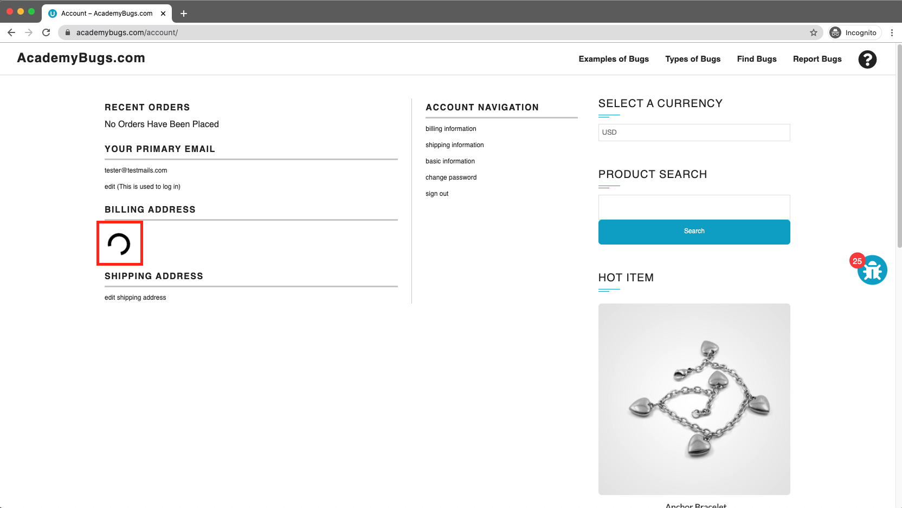
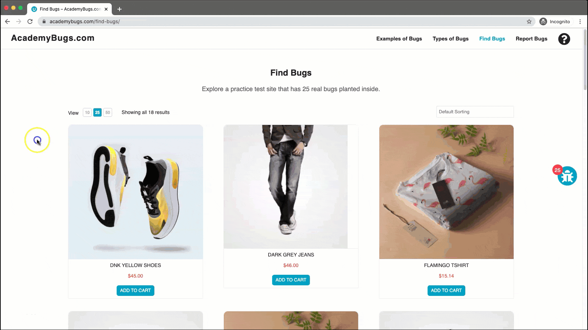

# Bug Report

## Bug ID
BUG-018

## Title
Billing Address section hangs on an infinite loading loop in user Dashboard

## Environment
- OS: Windows / macOS
- Browser: Chrome / Firefox / Edge
- Website: https://academybugs.com

## Preconditions
User is logged in on the AcademyBugs website.

## Steps to Reproduce
1. Open the browser and navigate to `https://academybugs.com`
2. Click on the **Find Bugs** link in the navigation bar
3. Open any product page
4. Sign in (or sign up) via the form at the bottom of the right side menu
5. Click on **Dashboard** at the bottom of the right side menu
6. Scroll up to the **Billing Address** section

## Expected Result
The Billing Address section should load and display the user's billing information.

## Actual Result
The Billing Address section displays a loading indicator indefinitely and fails to load content.

## Severity
Medium

## Priority
Medium

## Attachment

