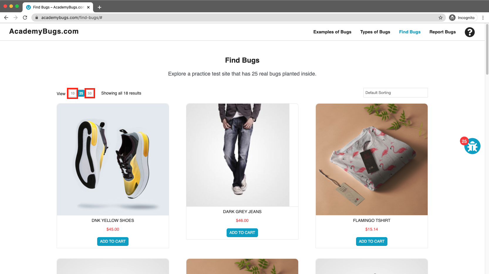

# Bug Report

## Bug ID
BUG-022

## Title
Application freezes completely when selecting the number of items per page

## Environment
- OS: Windows / macOS
- Browser: Chrome / Firefox / Edge
- Website: https://academybugs.com

## Preconditions
User is on the AcademyBugs homepage.

## Steps to Reproduce
1. Open the browser and navigate to `https://academybugs.com`
2. Click on the **Find Bugs** link in the navigation bar
3. Click on the buttons at the top left to change the number of displayed results per page

## Expected Result
The product grid should reload and display the selected number of items per page.

## Actual Result
The application freezes and becomes entirely unresponsive upon clicking the results count buttons.

## Severity
High

## Priority
High

## Attachment

