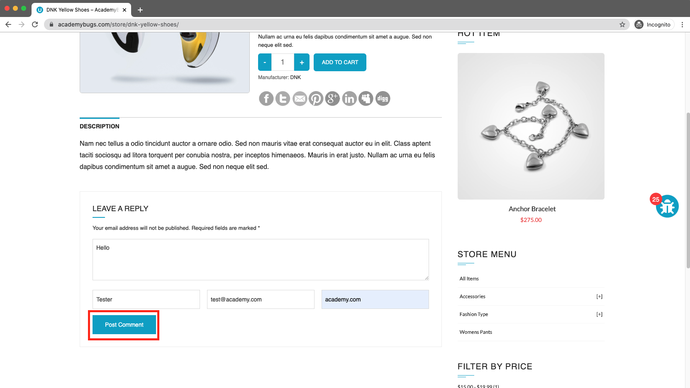
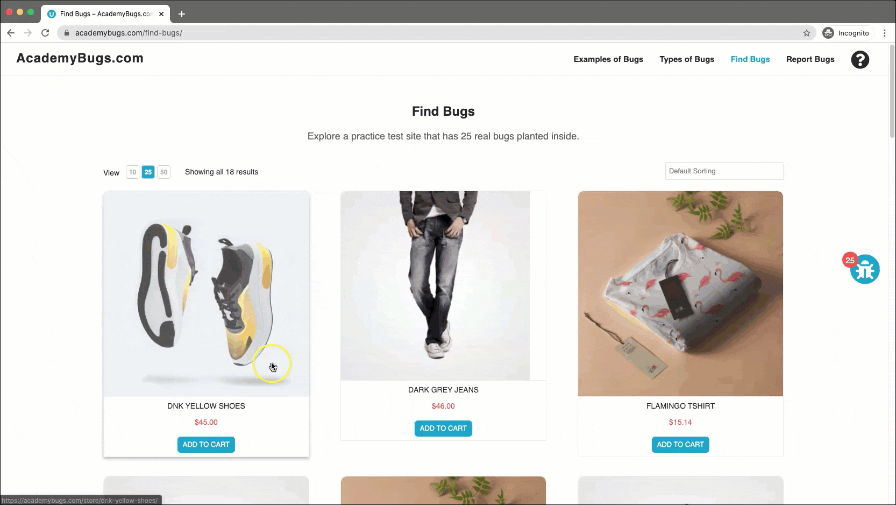

# Bug Report

## Bug ID
BUG-023

## Title
Application freezes completely when submitting a comment via "Post Comment" button

## Environment
- OS: Windows / macOS
- Browser: Chrome / Firefox / Edge
- Website: https://academybugs.com

## Preconditions
User is on the AcademyBugs homepage.

## Steps to Reproduce
1. Open the browser and navigate to `https://academybugs.com`
2. Click on the **Find Bugs** link in the navigation bar
3. Click on any product to open its details page
4. Scroll down to the **Leave a Reply** section
5. Fill out the comment form fields
6. Click the **Post Comment** button

## Expected Result
The comment should be successfully posted and displayed under the product's comment section.

## Actual Result
The page becomes unresponsive and freezes completely upon clicking "Post Comment".

## Severity
High

## Priority
High

## Attachment

