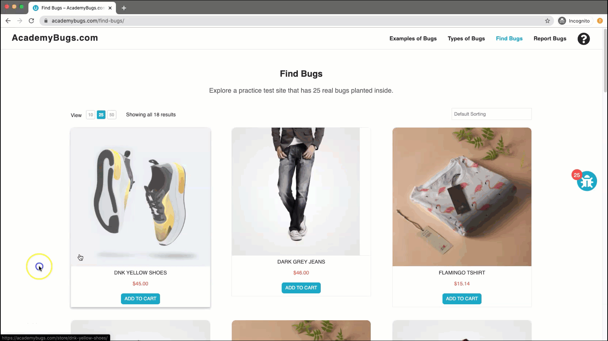

# Bug Report

## Bug ID
BUG-024

## Title
Application freezes completely when clicking the Retrieve Password button

## Environment
- OS: Windows / macOS
- Browser: Chrome / Firefox / Edge
- Website: https://academybugs.com

## Preconditions
User is on the AcademyBugs homepage.

## Steps to Reproduce
1. Open the browser and navigate to `https://academybugs.com`
2. Click on the **Find Bugs** link in the navigation bar
3. Click on any product to open its details page
4. Scroll down to the **Your Account** section of the right-side menu
5. Click **Sign Up**
6. Under the Returning Customer section, click **Forgot Your Password?**
7. Enter a valid email address into the field and click **Retrieve Password**

## Expected Result
A password retrieval email should be sent to the entered email address with proper feedback displayed to the user.

## Actual Result
The page becomes unresponsive and freezes completely upon clicking "Retrieve Password", and no email is sent.

## Severity
High

## Priority
High

## Attachment

