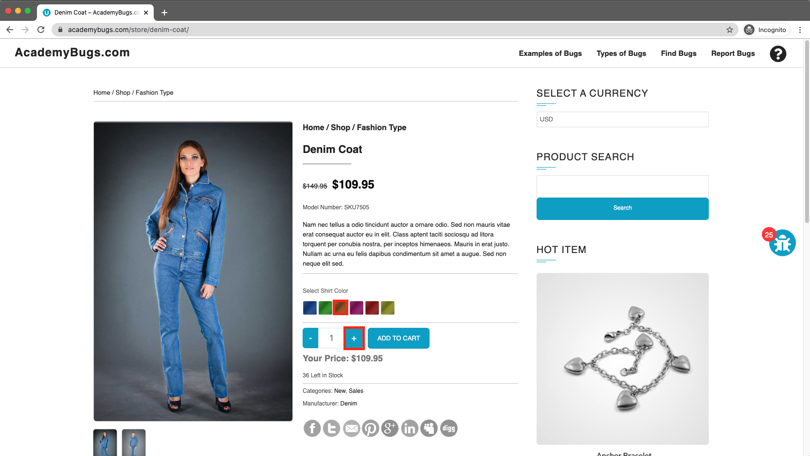
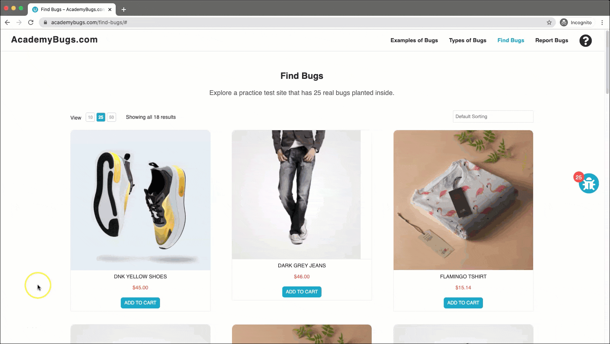

# Bug Report

## Bug ID
BUG-025

## Title
Application freezes completely when increasing quantity for products with Green or Pink color selected

## Environment
- OS: Windows / macOS
- Browser: Chrome / Firefox / Edge
- Website: https://academybugs.com

## Preconditions
User is on the AcademyBugs homepage.

## Steps to Reproduce
1. Open the browser and navigate to `https://academybugs.com`
2. Click on the **Find Bugs** link in the navigation bar
3. Click on a product that offers color selection options
4. Select either the **Green** or **Pink** color option
5. Increase the product quantity by 1 or more

## Expected Result
The quantity input updates correctly to the selected numeric value without impacting site performance.

## Actual Result
The page becomes completely unresponsive and freezes upon attempting to increase the quantity with Green or Pink color selected.

## Severity
High

## Priority
High

## Attachment

